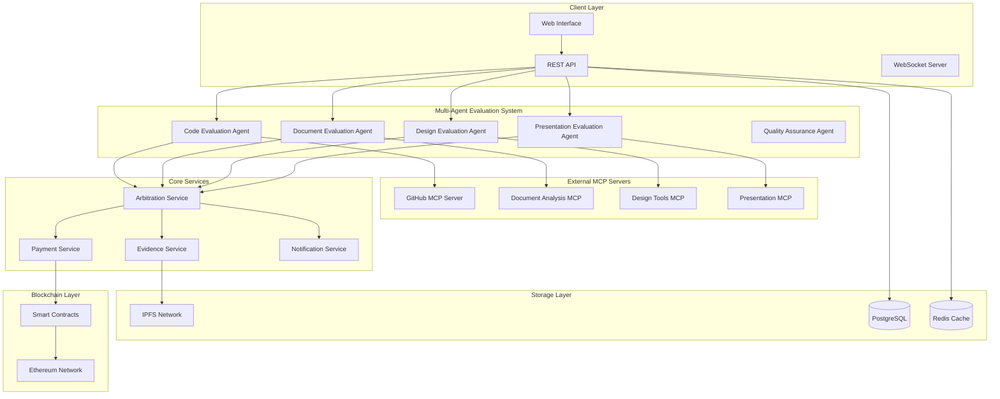
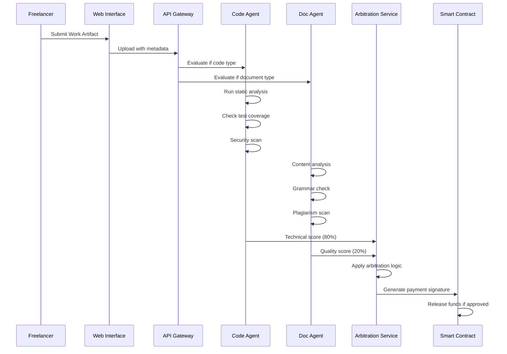

# Vera Protocol - Comprehensive Design Document

## Overview

Vera Protocol is a comprehensive AI-mediated escrow platform that supports multiple types of freelance work through specialized multi-agent evaluation systems. The platform uses external MCP servers for tool integration, real-time quality monitoring, and evidence-based neutral arbitration.

## Architecture

### System Architecture Diagram



### Multi-Agent Evaluation Flow



## Components and Interfaces

### 1. Multi-Agent Evaluation System

#### Code Evaluation Agent
```typescript
interface CodeEvaluationAgent {
  evaluateRepository(repoUrl: string, requirements: CodeRequirement[]): Promise<CodeEvaluation>;
  runStaticAnalysis(codebase: string): Promise<StaticAnalysisResult>;
  checkTestCoverage(testSuite: string): Promise<CoverageReport>;
  scanSecurity(dependencies: string[]): Promise<SecurityReport>;
  validateDocumentation(docs: string[]): Promise<DocumentationScore>;
}

interface CodeEvaluation {
  overallScore: number;
  codeQuality: QualityMetrics;
  testCoverage: number;
  securityScore: number;
  documentationScore: number;
  compilationStatus: CompilationResult;
  recommendations: string[];
}
```

#### Document Evaluation Agent
```typescript
interface DocumentEvaluationAgent {
  evaluateDocument(content: string, requirements: DocumentRequirement[]): Promise<DocumentEvaluation>;
  checkGrammar(text: string): Promise<GrammarReport>;
  analyzeContent(text: string): Promise<ContentAnalysis>;
  detectPlagiarism(text: string): Promise<PlagiarismReport>;
  validateFormat(document: File): Promise<FormatValidation>;
}

interface DocumentEvaluation {
  overallScore: number;
  contentQuality: number;
  grammarScore: number;
  originalityScore: number;
  formatCompliance: number;
  readabilityScore: number;
  recommendations: string[];
}
```

#### Design Evaluation Agent
```typescript
interface DesignEvaluationAgent {
  evaluateDesign(files: DesignFile[], requirements: DesignRequirement[]): Promise<DesignEvaluation>;
  checkBrandCompliance(design: DesignFile, guidelines: BrandGuidelines): Promise<ComplianceReport>;
  validateAccessibility(design: DesignFile): Promise<AccessibilityReport>;
  analyzeVisualHierarchy(design: DesignFile): Promise<HierarchyAnalysis>;
  checkTechnicalSpecs(design: DesignFile, specs: TechnicalSpecs): Promise<SpecValidation>;
}

interface DesignEvaluation {
  overallScore: number;
  visualQuality: number;
  brandCompliance: number;
  accessibilityScore: number;
  technicalAccuracy: number;
  creativityScore: number;
  recommendations: string[];
}
```

### 2. External MCP Integration

#### MCP Server Configuration
```typescript
interface MCPServerConfig {
  name: string;
  endpoint: string;
  authentication: MCPAuth;
  capabilities: string[];
  fallbackStrategy: FallbackStrategy;
}

interface MCPAuth {
  type: 'oauth' | 'api_key' | 'jwt';
  credentials: Record<string, string>;
  refreshToken?: string;
}
```

#### GitHub MCP Server
```typescript
interface GitHubMCPServer {
  authenticateUser(oauthCode: string): Promise<GitHubAuth>;
  analyzeRepository(repoUrl: string): Promise<RepositoryAnalysis>;
  getCommitHistory(repoUrl: string, since: Date): Promise<CommitHistory>;
  runWorkflows(repoUrl: string, workflowId: string): Promise<WorkflowResult>;
  createWebhook(repoUrl: string, webhookConfig: WebhookConfig): Promise<WebhookResult>;
}
```

### 3. Real-Time Monitoring System

#### Hook System Architecture
```typescript
interface HookSystem {
  registerHook(hookConfig: HookConfig): Promise<void>;
  triggerHook(event: HookEvent): Promise<HookResult>;
  getHookStatus(hookId: string): Promise<HookStatus>;
  updateHookConfig(hookId: string, config: Partial<HookConfig>): Promise<void>;
}

interface HookConfig {
  id: string;
  name: string;
  triggers: HookTrigger[];
  actions: HookAction[];
  conditions: HookCondition[];
  settings: HookSettings;
}

interface HookTrigger {
  type: 'file_save' | 'git_commit' | 'test_run' | 'build_complete';
  patterns: string[];
  debounceMs: number;
}
```

### 4. Evidence Chain System

#### Evidence Collection
```typescript
interface EvidenceChain {
  projectId: string;
  milestoneId: string;
  entries: EvidenceEntry[];
  ipfsHash: string;
  signature: string;
}

interface EvidenceEntry {
  timestamp: number;
  agentId: string;
  action: string;
  input: any;
  output: any;
  metrics: Record<string, number>;
  artifacts: string[];
}
```

## Data Models

### Project Model
```typescript
interface Project {
  id: string;
  title: string;
  description: string;
  workTypes: WorkType[];
  requirements: Requirement[];
  client: User;
  freelancer: User;
  milestones: Milestone[];
  paymentStructure: PaymentStructure;
  status: ProjectStatus;
  createdAt: Date;
  updatedAt: Date;
}

enum WorkType {
  SOFTWARE_DEVELOPMENT = 'software_development',
  DOCUMENT_CREATION = 'document_creation',
  DESIGN_WORK = 'design_work',
  PRESENTATION = 'presentation',
  DATA_ANALYSIS = 'data_analysis',
  CONTENT_CREATION = 'content_creation'
}
```

### Evaluation Model
```typescript
interface Evaluation {
  id: string;
  milestoneId: string;
  agentType: AgentType;
  workArtifacts: WorkArtifact[];
  scores: EvaluationScores;
  evidence: EvidenceChain;
  recommendations: Recommendation[];
  status: EvaluationStatus;
  completedAt: Date;
}

interface EvaluationScores {
  technical: number;
  quality: number;
  compliance: number;
  creativity?: number;
  overall: number;
}
```

## Correctness Properties

*A property is a characteristic or behavior that should hold true across all valid executions of the system. Properties serve as the bridge between human-readable specifications and machine-verifiable correctness guarantees.*

### Property 1: Multi-Agent Evaluation Consistency
*For any* work artifact and set of requirements, when multiple evaluation agents assess the same artifact, the combined score should be deterministic and reproducible within a 5% variance.
**Validates: Requirements 2.5**

### Property 2: Evidence Chain Immutability
*For any* evaluation process, once an evidence entry is recorded, it cannot be modified or deleted, ensuring complete audit trail integrity.
**Validates: Requirements 5.1, 5.2**

### Property 3: Real-Time Feedback Responsiveness
*For any* file save or commit event, the system should provide feedback within 2 seconds for 95% of operations.
**Validates: Requirements 4.1, 4.2, 4.3, 4.4**

### Property 4: MCP Server Fallback Reliability
*For any* MCP server failure, the system should automatically switch to fallback evaluation methods without losing functionality.
**Validates: Requirements 3.4**

### Property 5: Payment Logic Accuracy
*For any* completed evaluation with technical score ≥80%, the system should automatically release exactly 80% of the milestone payment.
**Validates: Requirements 6.3**

### Property 6: Cross-Platform Integration Consistency
*For any* supported external tool integration, the system should maintain consistent data synchronization and user experience.
**Validates: Requirements 8.1, 8.2, 8.3, 8.4**

### Property 7: Quality Threshold Enforcement
*For any* work submission below quality thresholds, the system should provide specific, actionable improvement recommendations.
**Validates: Requirements 9.5**

### Property 8: Scalability Performance Maintenance
*For any* system load up to 10,000 concurrent evaluations, response times should remain within specified performance bounds.
**Validates: Requirements 10.1, 10.2**

## Error Handling

### Error Classification
```typescript
enum ErrorType {
  EVALUATION_FAILURE = 'evaluation_failure',
  MCP_CONNECTION_ERROR = 'mcp_connection_error',
  AUTHENTICATION_ERROR = 'authentication_error',
  VALIDATION_ERROR = 'validation_error',
  PAYMENT_ERROR = 'payment_error',
  STORAGE_ERROR = 'storage_error'
}

interface ErrorHandler {
  handleError(error: VeraError): Promise<ErrorResolution>;
  retryOperation(operation: Operation, maxRetries: number): Promise<OperationResult>;
  escalateError(error: VeraError): Promise<void>;
}
```

### Fallback Strategies
1. **MCP Server Failures**: Switch to local evaluation algorithms
2. **Network Issues**: Queue operations for retry with exponential backoff
3. **Authentication Failures**: Redirect to re-authentication flow
4. **Storage Failures**: Use multiple IPFS gateways and local caching

## Testing Strategy

### Unit Testing
- Test individual evaluation agents with mock data
- Verify MCP server integration with test servers
- Test error handling and fallback mechanisms
- Validate payment calculation logic

### Integration Testing
- Test complete evaluation workflows
- Verify cross-agent communication
- Test real-time monitoring and feedback
- Validate evidence chain creation

### Property-Based Testing
- Generate random work artifacts and verify evaluation consistency
- Test system behavior under various load conditions
- Verify payment logic with random project configurations
- Test error recovery mechanisms with simulated failures

### Performance Testing
- Load test with 10,000+ concurrent evaluations
- Stress test MCP server connections
- Test real-time feedback under high load
- Benchmark evaluation agent performance

## Security Considerations

### Authentication & Authorization
- Multi-factor authentication for sensitive operations
- Role-based access control for different user types
- API key management for MCP server connections
- JWT token validation for all API requests

### Data Protection
- End-to-end encryption for sensitive data
- IPFS content encryption for private projects
- Secure key management for blockchain operations
- Regular security audits and penetration testing

### Smart Contract Security
- Reentrancy guards on all payment functions
- Access control for administrative functions
- Emergency pause mechanisms for critical issues
- Formal verification of payment logic

## Deployment Architecture

### Microservices Design
```
┌─────────────────┐    ┌─────────────────┐    ┌─────────────────┐
│   Web Frontend  │    │   API Gateway   │    │ Evaluation Svc  │
│   (Next.js)     │◀──▶│   (Express)     │◀──▶│ (Multi-Agent)   │
└─────────────────┘    └─────────────────┘    └─────────────────┘
         │                       │                       │
         ▼                       ▼                       ▼
┌─────────────────┐    ┌─────────────────┐    ┌─────────────────┐
│   CDN/Cache     │    │ Message Queue   │    │ MCP Connectors  │
│   (CloudFlare)  │    │   (Redis)       │    │ (External APIs) │
└─────────────────┘    └─────────────────┘    └─────────────────┘
```

### Scalability Strategy
- Horizontal scaling of evaluation agents
- Load balancing with health checks
- Database read replicas for performance
- Caching layers for frequently accessed data
- Auto-scaling based on demand metrics