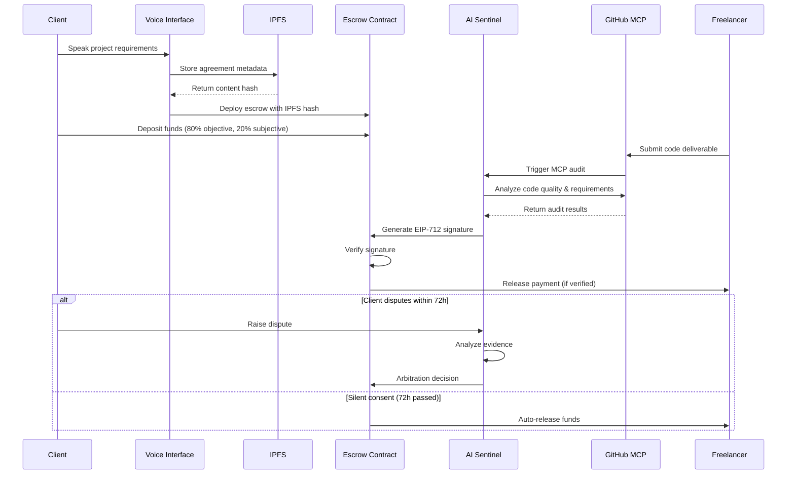

# Design Document

## Overview

Vera Protocol is a decentralized AI-mediated freelance escrow platform that eliminates payment disputes through intelligent milestone management and automated arbitration. The system operates as a Pure Web3 solution using IPFS for data storage, Ethereum for financial transactions, and AI agents as autonomous oracles for objective milestone verification.

The platform implements an 80/20 payment split where 80% of funds are tied to objective technical deliverables and 20% serves as a subjective variance buffer. A Silent Consent protocol automatically releases funds after 72 hours of client inactivity, ensuring freelancers receive timely payments.

## Architecture

### High-Level System Flow



### Component Architecture

The system consists of four main layers:

1. **Presentation Layer**: Next.js frontend with voice interface
2. **AI Agent Layer**: Autonomous verification and arbitration agents
3. **Blockchain Layer**: Ethereum smart contracts for escrow management
4. **Storage Layer**: IPFS for decentralized metadata storage

## Components and Interfaces

### Voice Interface Component
- **Purpose**: Convert natural language to structured project agreements
- **Technology**: Web Speech API + NLP processing
- **Interface**: RESTful API for speech-to-text conversion
- **Output**: Structured JSON agreement format

### IPFS Storage Component
- **Purpose**: Decentralized storage of project metadata and agreements
- **Technology**: IPFS HTTP API with content addressing
- **Interface**: Content hash-based retrieval system
- **Data Format**: JSON metadata with cryptographic integrity

### Smart Contract System
- **Purpose**: Escrow management and automated payment release
- **Technology**: Solidity contracts on Ethereum mainnet
- **Key Contracts**:
  - `VeraEscrow.sol`: Main escrow logic with 80/20 split
  - `EIP712Verifier.sol`: Signature verification for payouts
- **Interface**: Web3 provider integration with typed contract calls

### AI Sentinel Agent
- **Purpose**: Objective milestone verification and dispute arbitration
- **Technology**: TypeScript agents with MCP server integration
- **Key Functions**:
  - Code quality analysis via GitHub MCP
  - Requirements verification against IPFS agreements
  - EIP-712 signature generation for verified payouts
- **Interface**: WebSocket for real-time status updates

### GitHub MCP Server
- **Purpose**: Automated code analysis and repository verification
- **Technology**: Model Context Protocol with GitHub API integration
- **Capabilities**:
  - Repository structure analysis
  - Code quality metrics
  - Security vulnerability scanning
  - Documentation completeness verification

## Data Models

### Project Agreement Model
```typescript
interface ProjectAgreement {
  id: string;
  clientAddress: string;
  freelancerAddress: string;
  title: string;
  description: string;
  objectives: ObjectiveMilestone[];
  subjectiveElements: SubjectiveElement[];
  totalValue: bigint;
  timeline: number;
  ipfsHash: string;
  createdAt: number;
}
```

### Milestone Model
```typescript
interface ObjectiveMilestone {
  id: string;
  title: string;
  description: string;
  requirements: string[];
  value: bigint; // 80% of total allocation
  githubRepo?: string;
  deliverables: string[];
  verificationCriteria: VerificationCriteria;
}

interface SubjectiveElement {
  id: string;
  description: string;
  value: bigint; // 20% of total allocation
  evaluationCriteria: string[];
}
```

### Verification Result Model
```typescript
interface VerificationResult {
  milestoneId: string;
  status: 'pending' | 'verified' | 'failed' | 'disputed';
  technicalScore: number;
  qualityMetrics: QualityMetrics;
  aiReasoning: string;
  timestamp: number;
  signature?: EIP712Signature;
}
```

### EIP-712 Signature Model
```typescript
interface PayoutSignature {
  types: {
    EIP712Domain: Array<{name: string; type: string}>;
    Payout: Array<{name: string; type: string}>;
  };
  primaryType: 'Payout';
  domain: {
    name: 'VeraProtocol';
    version: '1';
    chainId: number;
    verifyingContract: string;
  };
  message: {
    milestoneId: string;
    recipient: string;
    amount: string;
    timestamp: number;
  };
}
```

Now I need to use the prework tool to analyze the acceptance criteria before writing the Correctness Properties section:

## Correctness Properties

*A property is a characteristic or behavior that should hold true across all valid executions of a system-essentially, a formal statement about what the system should do. Properties serve as the bridge between human-readable specifications and machine-verifiable correctness guarantees.*

### Property 1: Voice-to-Text Conversion Performance
*For any* valid speech input, the Voice_Handshake should convert speech to structured text within 2 seconds and produce a valid agreement format
**Validates: Requirements 1.1, 1.2**

### Property 2: IPFS Storage Round Trip
*For any* project agreement, storing on IPFS then retrieving by content hash should produce an equivalent agreement object
**Validates: Requirements 1.3, 1.4**

### Property 3: Natural Language Parsing Completeness
*For any* natural language project description containing scope, timeline, and budget, the Voice_Handshake should extract all three elements into structured format
**Validates: Requirements 1.5**

### Property 4: Escrow Contract 80/20 Split
*For any* deposit amount, the smart contract should allocate exactly 80% to objective milestones and 20% to subjective variance buffer
**Validates: Requirements 2.2**

### Property 5: Automated Payment Release
*For any* verified milestone completion, the system should automatically release the corresponding payment amount without manual intervention
**Validates: Requirements 2.3**

### Property 6: Silent Consent Timing
*For any* milestone completion, if no dispute is raised within 72 hours, the system should automatically release funds
**Validates: Requirements 2.5**

### Property 7: Dispute Pause Mechanism
*For any* dispute raised within 72 hours of milestone completion, the system should immediately pause auto-release and initiate arbitration
**Validates: Requirements 2.4**

### Property 8: GitHub MCP Code Analysis
*For any* submitted GitHub repository, the MCP server should analyze code quality and return structured assessment results
**Validates: Requirements 3.1, 3.5**

### Property 9: Requirements Verification Consistency
*For any* set of requirements and deliverables, the AI_Sentinel should consistently determine whether requirements are met
**Validates: Requirements 3.2, 3.3**

### Property 10: EIP-712 Signature Structure
*For any* verified milestone, the generated EIP-712 signature should contain milestone ID, amount, recipient, and timestamp
**Validates: Requirements 4.1, 4.4**

### Property 11: Cryptographic Signature Validity
*For any* generated EIP-712 signature, the signature should be cryptographically valid and verifiable on-chain
**Validates: Requirements 4.2, 4.3**

### Property 12: Transaction Event Emission
*For any* completed blockchain transaction, the system should emit a payment confirmation event with transaction details
**Validates: Requirements 4.5**

### Property 13: Dispute Analysis Time Bound
*For any* raised dispute, the AI_Sentinel should complete evidence analysis within 24 hours
**Validates: Requirements 5.1**

### Property 14: Original Agreement Prioritization
*For any* dispute evaluation, the AI_Sentinel should prioritize the original IPFS agreement over subsequent modification requests
**Validates: Requirements 5.2**

### Property 15: Pro-Rata Payment Calculation
*For any* partially completed technical work, the AI_Sentinel should calculate payment proportional to completion percentage
**Validates: Requirements 5.3**

### Property 16: Subjective Buffer Holding
*For any* disputed subjective element, the system should hold the 20% variance buffer for human review
**Validates: Requirements 5.4**

### Property 17: Decentralized Storage Consistency
*For any* system operation, all data should be stored on IPFS or blockchain without centralized database dependencies
**Validates: Requirements 6.1, 6.2, 6.3**

### Property 18: Data Integrity Preservation
*For any* stored data, cryptographic hashes and signatures should maintain integrity across storage and retrieval operations
**Validates: Requirements 6.4**

### Property 19: Real-Time Status Broadcasting
*For any* milestone status change, WebSocket connections should broadcast updates to all connected stakeholders
**Validates: Requirements 7.1**

### Property 20: Dual-Party Payment Notification
*For any* payment release, both freelancer and client should receive immediate notifications
**Validates: Requirements 7.2**

### Property 21: Dispute Alert Timing
*For any* raised dispute, relevant stakeholders should receive alerts within 1 minute
**Validates: Requirements 7.3**

### Property 22: Connection State Resilience
*For any* network interruption, the system should maintain connection state and sync missed updates upon reconnection
**Validates: Requirements 7.4, 7.5**

### Property 23: Voice Recognition Accuracy
*For any* clear voice command related to project management, the system should achieve 98% recognition accuracy
**Validates: Requirements 8.1**

### Property 24: Voice Processing Performance
*For any* voice command, processing should complete within 1000ms for responsive interaction
**Validates: Requirements 8.5**

### Property 25: Multi-Language Voice Support
*For any* supported language, voice commands should be processed with equivalent accuracy and functionality
**Validates: Requirements 8.3**

### Property 26: Fallback Interface Activation
*For any* voice processing failure, the system should automatically provide visual fallback interfaces
**Validates: Requirements 8.4**

## Error Handling

### Voice Interface Error Handling
- **Speech Recognition Failures**: Automatic fallback to text input with visual prompts
- **Unclear Audio Input**: Request for clarification with specific guidance on expected input format
- **Network Connectivity Issues**: Offline mode with local storage and sync upon reconnection
- **Language Detection Errors**: Default to English with option to manually select language

### Smart Contract Error Handling
- **Insufficient Gas**: Automatic gas estimation with user confirmation for higher limits
- **Transaction Failures**: Retry mechanism with exponential backoff up to 3 attempts
- **Invalid Signatures**: Clear error messages with signature regeneration option
- **Contract Deployment Failures**: Rollback mechanism with detailed error reporting

### IPFS Storage Error Handling
- **Upload Failures**: Retry with different IPFS gateways and local node fallback
- **Content Retrieval Errors**: Multiple gateway attempts with cached fallback
- **Hash Verification Failures**: Re-upload with integrity checking
- **Network Partitioning**: Local storage with eventual consistency synchronization

### AI Agent Error Handling
- **GitHub API Rate Limits**: Exponential backoff with alternative analysis methods
- **Code Analysis Failures**: Partial analysis with manual review flags
- **Dispute Processing Errors**: Escalation to human arbitrators with full context
- **Signature Generation Failures**: Secure key regeneration with audit trail

## Testing Strategy

### Dual Testing Approach
The system requires both unit testing and property-based testing for comprehensive coverage:

- **Unit Tests**: Verify specific examples, edge cases, and error conditions
- **Property Tests**: Verify universal properties across all inputs using randomized testing
- **Integration Tests**: Verify end-to-end workflows across system components

### Property-Based Testing Configuration
- **Testing Framework**: fast-check for TypeScript/JavaScript components
- **Minimum Iterations**: 100 test cases per property to ensure statistical confidence
- **Test Tagging**: Each property test tagged with format: **Feature: vera-protocol, Property {number}: {property_text}**
- **Randomization Strategy**: Smart generators that constrain inputs to valid system states

### Unit Testing Focus Areas
- **Voice Interface**: Specific speech patterns and edge cases
- **Smart Contracts**: Gas optimization and security vulnerabilities  
- **IPFS Integration**: Content addressing and retrieval patterns
- **AI Agents**: Decision logic and reasoning transparency
- **WebSocket Connections**: Connection management and message delivery

### Integration Testing Scenarios
- **Complete Project Lifecycle**: Voice creation → IPFS storage → Contract deployment → Milestone completion → Payment release
- **Dispute Resolution Flow**: Dispute raising → Evidence analysis → Arbitration decision → Payment adjustment
- **Network Resilience**: Offline operation → Reconnection → State synchronization
- **Multi-User Scenarios**: Concurrent project management with real-time updates

### Performance Testing Requirements
- **Voice Processing**: Sub-1000ms response times under various network conditions
- **Blockchain Transactions**: Gas optimization and transaction confirmation times
- **IPFS Operations**: Upload/download performance across different file sizes
- **WebSocket Scalability**: Connection limits and message throughput testing