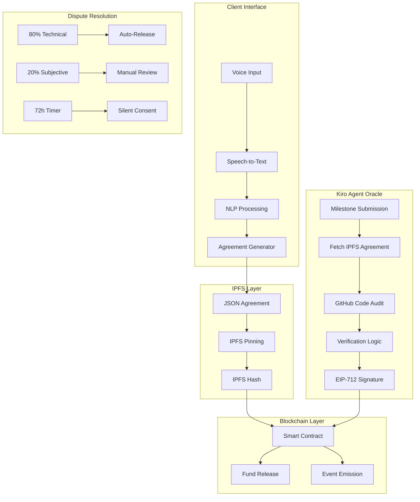
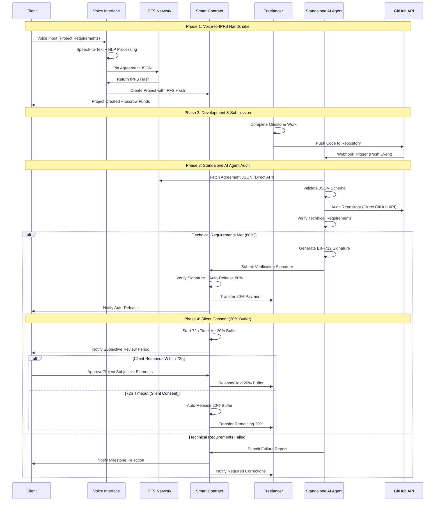
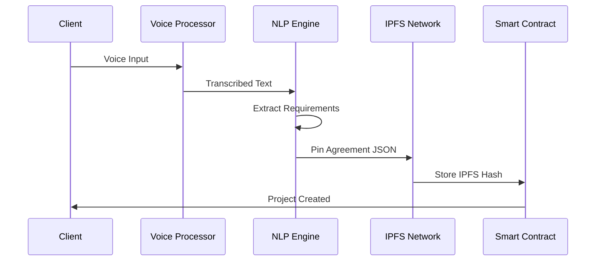
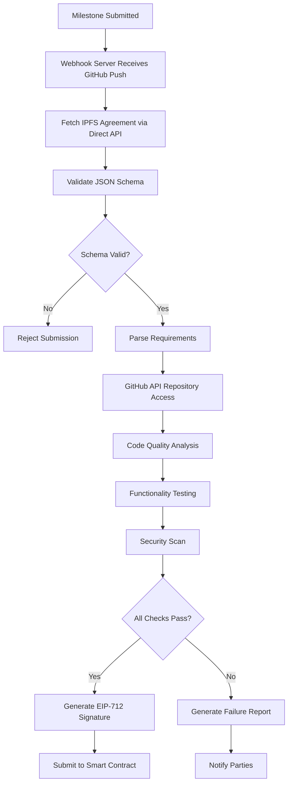
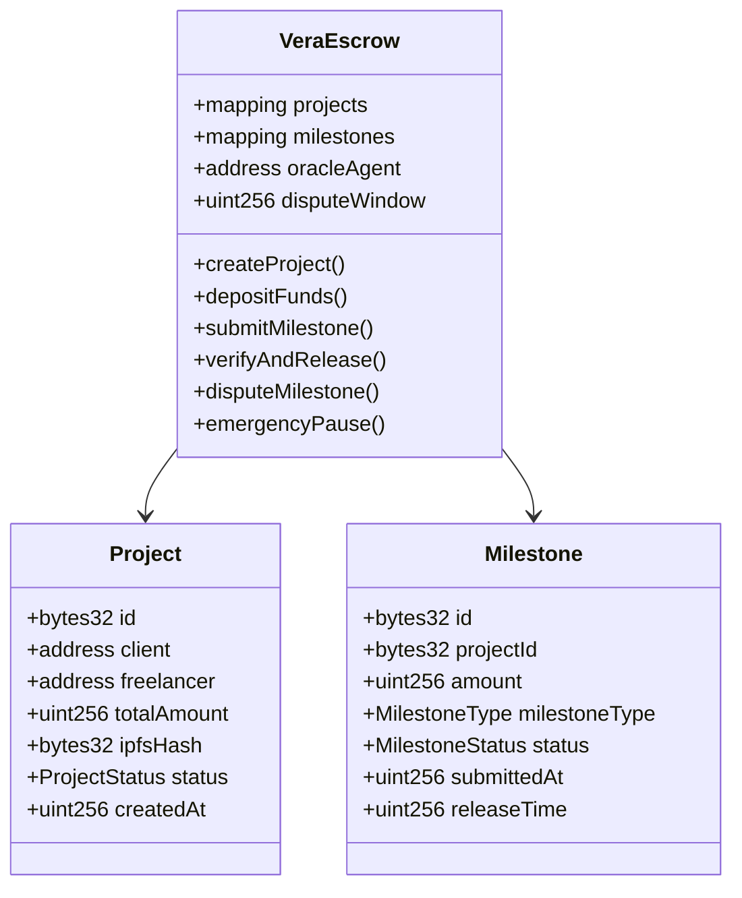
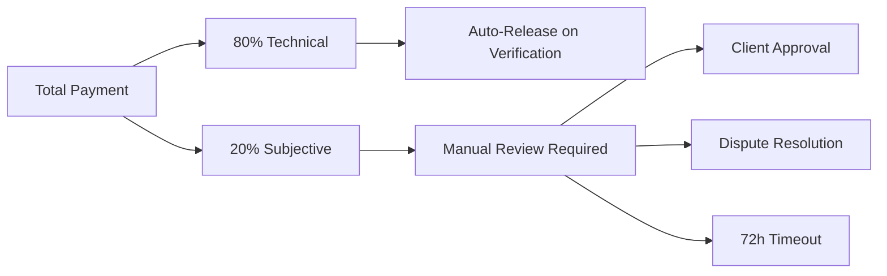
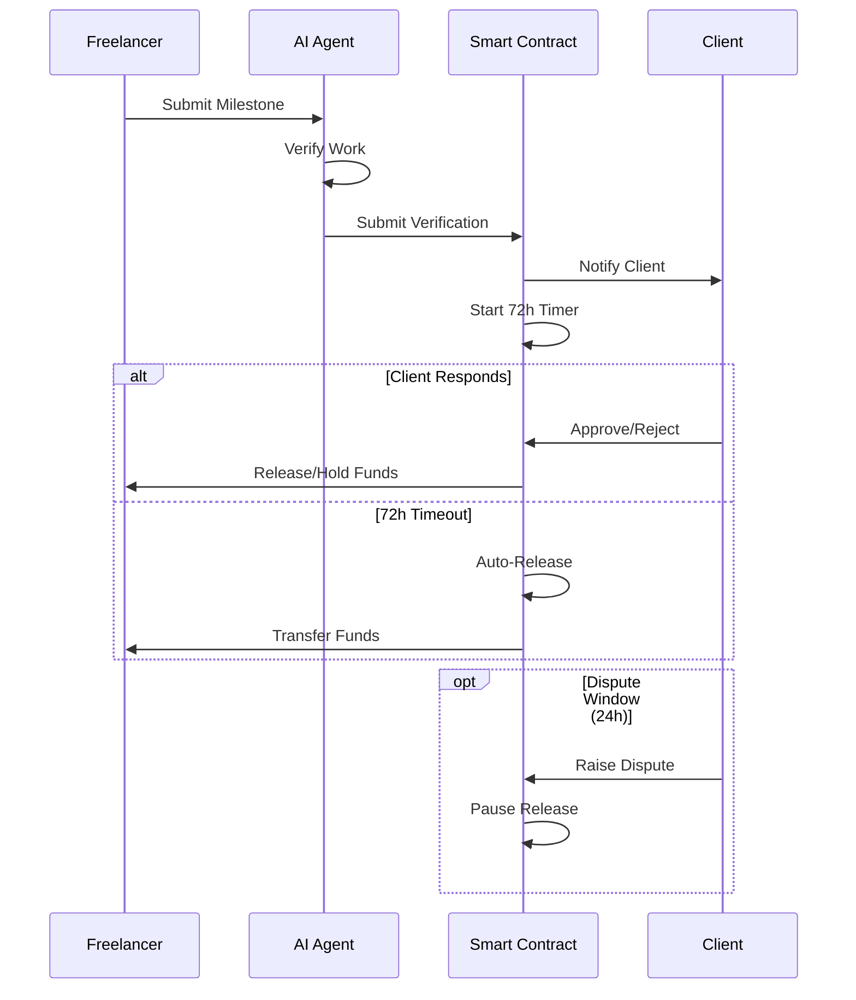
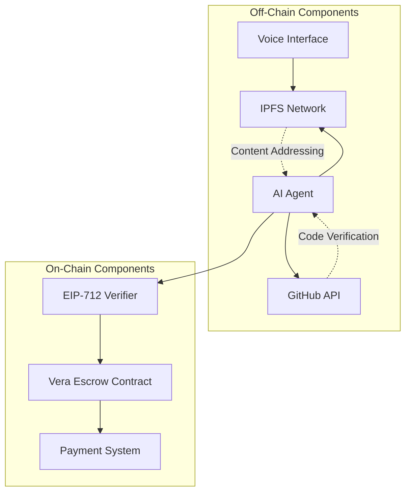

# Vera Protocol - System Design

## Architecture Overview
Vera Protocol implements a Pure Web3 escrow system using AI agents as off-chain oracles, IPFS for decentralized storage, and smart contracts for trustless fund management.

## System Architecture



## Complete Workflow Sequence



## Component Design

### 1. Voice-to-IPFS Pipeline



#### Agreement JSON Structure
```json
{
  "projectId": "uuid",
  "title": "string",
  "description": "string",
  "requirements": {
    "technical": [
      {
        "id": "milestone_1",
        "description": "string",
        "acceptanceCriteria": ["string"],
        "weight": 0.4,
        "type": "technical"
      }
    ],
    "subjective": [
      {
        "id": "design_review",
        "description": "string",
        "weight": 0.2,
        "type": "subjective"
      }
    ]
  },
  "payment": {
    "total": "1000000000000000000",
    "currency": "ETH",
    "milestones": [
      {
        "id": "milestone_1",
        "amount": "800000000000000000",
        "type": "technical"
      }
    ]
  },
  "parties": {
    "client": "0x...",
    "freelancer": "0x..."
  },
  "timeline": {
    "created": "timestamp",
    "deadline": "timestamp"
  },
  "ipfsHash": "QmHash...",
  "signature": "0x..."
}
```

### 2. Standalone AI Agent Verification System

**Production AI Agents**: Independent TypeScript agents with direct GitHub API integration for repository analysis and milestone verification.



#### Verification Criteria
- **Code Quality**: ESLint/Prettier compliance, TypeScript types
- **Functionality**: Unit tests pass, integration tests pass
- **Security**: No critical vulnerabilities, dependency audit clean
- **Requirements**: All acceptance criteria met
- **Documentation**: README, API docs, deployment guide

### 3. EIP-712 Typed Data Structure

```solidity
struct VerificationData {
    bytes32 projectId;
    bytes32 milestoneId;
    address freelancer;
    uint256 amount;
    uint256 timestamp;
    bytes32 ipfsHash;
    bool approved;
}

bytes32 constant VERIFICATION_TYPEHASH = keccak256(
    "VerificationData(bytes32 projectId,bytes32 milestoneId,address freelancer,uint256 amount,uint256 timestamp,bytes32 ipfsHash,bool approved)"
);
```

### 4. Smart Contract Architecture



### 5. 80/20 Variance Buffer Implementation



#### Buffer Logic
```solidity
function calculatePayout(bytes32 milestoneId) internal view returns (uint256) {
    Milestone memory milestone = milestones[milestoneId];
    
    if (milestone.milestoneType == MilestoneType.TECHNICAL) {
        return milestone.amount; // Full amount for technical milestones
    } else {
        return milestone.amount * 20 / 100; // 20% for subjective elements
    }
}
```

### 6. Silent Consent Protocol



### 7. Data Flow Architecture



## Security Considerations

### 1. Oracle Security
- **Multi-signature validation** for agent authorization
- **Reputation system** for agent reliability
- **Slashing conditions** for malicious behavior
- **Backup oracle network** for redundancy

### 2. Smart Contract Security
- **Reentrancy guards** on all external calls
- **Access control** with role-based permissions
- **Pause mechanism** for emergency stops
- **Upgrade proxy pattern** for contract evolution

### 3. IPFS Security
- **Content addressing** ensures immutability
- **Pinning services** prevent data loss
- **Encryption** for sensitive project details
- **Backup storage** across multiple nodes

## Scalability Design

### 1. Layer 2 Integration
- Deploy on Polygon for lower gas costs
- Use state channels for frequent updates
- Implement rollup solutions for batch processing

### 2. IPFS Optimization
- Use IPFS clusters for high availability
- Implement content caching strategies
- Optimize JSON structures for minimal size

### 3. Agent Scaling
- Horizontal scaling of verification agents
- Load balancing across agent instances
- Async processing for non-critical operations

## Integration Points

### 1. MCP Server Configuration
```json
{
  "mcpServers": {
    "github": {
      "command": "uvx",
      "args": ["github-mcp-server@latest"],
      "env": {
        "GITHUB_TOKEN": "ghp_..."
      }
    },
    "fetch": {
      "command": "uvx",
      "args": ["fetch-mcp-server@latest"]
    }
  }
}
```

### 2. Agent Workflow
1. **Trigger**: Milestone submission event
2. **Fetch**: IPFS agreement using #[fetch]
3. **Audit**: GitHub repository using #[github]
4. **Verify**: Compare against requirements
5. **Sign**: Generate EIP-712 signature
6. **Submit**: Send to smart contract

This design ensures complete decentralization while maintaining security, scalability, and user experience aligned with the Vera Protocol vision.