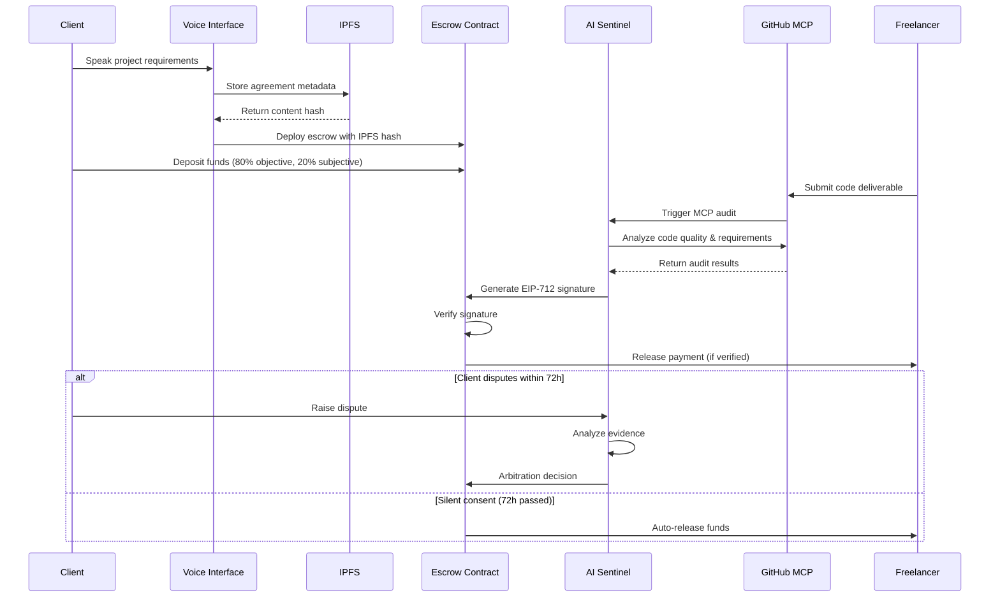

# Design Document

## Overview

Vera Protocol is a decentralized AI-mediated freelance escrow platform that eliminates payment disputes through intelligent milestone management and automated arbitration. The system operates as a Pure Web3 solution using IPFS for data storage, Ethereum for financial transactions, and AI agents as autonomous oracles for objective milestone verification.

The platform implements an 80/20 payment split where 80% of funds are tied to objective technical deliverables and 20% serves as a subjective variance buffer. A Silent Consent protocol automatically releases funds after 72 hours of client inactivity, ensuring freelancers receive timely payments.

## Architecture

### High-Level System Flow



### Component Architecture

The system consists of four main layers:

1. **Presentation Layer**: Next.js frontend with voice interface
2. **AI Agent Layer**: Autonomous verification and arbitration agents
3. **Blockchain Layer**: Ethereum smart contracts for escrow management
4. **Storage Layer**: IPFS for decentralized metadata storage

## Components and Interfaces

### Voice Interface Component
- **Purpose**: Convert natural language to structured project agreements
- **Technology**: Web Speech API + NLP processing
- **Interface**: RESTful API for speech-to-text conversion
- **Output**: Structured JSON agreement format

### IPFS Storage Component
- **Purpose**: Decentralized storage of project metadata and agreements
- **Technology**: IPFS HTTP API with content addressing
- **Interface**: Content hash-based retrieval system
- **Data Format**: JSON metadata with cryptographic integrity

### Smart Contract System
- **Purpose**: Escrow management and automated payment release
- **Technology**: Solidity contracts on Ethereum mainnet
- **Key Contracts**:
  - `VeraEscrow.sol`: Main escrow logic with 80/20 split
  - `EIP712Verifier.sol`: Signature verification for payouts
- **Interface**: Web3 provider integration with typed contract calls

### AI Sentinel Agent
- **Purpose**: Objective milestone verification and dispute arbitration
- **Technology**: TypeScript agents with MCP server integration
- **Key Functions**:
  - Code quality analysis via GitHub MCP
  - Requirements verification against IPFS agreements
  - EIP-712 signature generation for verified payouts
- **Interface**: WebSocket for real-time status updates

### GitHub MCP Server
- **Purpose**: Automated code analysis and repository verification
- **Technology**: Model Context Protocol with GitHub API integration
- **Capabilities**:
  - Repository structure analysis
  - Code quality metrics
  - Security vulnerability scanning
  - Documentation completeness verification

## Data Models

### Project Agreement Model
```typescript
interface ProjectAgreement {
  id: string;
  clientAddress: string;
  freelancerAddress: string;
  title: string;
  description: string;
  objectives: ObjectiveMilestone[];
  subjectiveElements: SubjectiveElement[];
  totalValue: bigint;
  timeline: number;
  ipfsHash: string;
  createdAt: number;
}
```

### Milestone Model
```typescript
interface ObjectiveMilestone {
  id: string;
  title: string;
  description: string;
  requirements: string[];
  value: bigint; // 80% of total allocation
  githubRepo?: string;
  deliverables: string[];
  verificationCriteria: VerificationCriteria;
}

interface SubjectiveElement {
  id: string;
  description: string;
  value: bigint; // 20% of total allocation
  evaluationCriteria: string[];
}
```

### Verification Result Model
```typescript
interface VerificationResult {
  milestoneId: string;
  status: 'pending' | 'verified' | 'failed' | 'disputed';
  technicalScore: number;
  qualityMetrics: QualityMetrics;
  aiReasoning: string;
  timestamp: number;
  signature?: EIP712Signature;
}
```

### EIP-712 Signature Model
```typescript
interface PayoutSignature {
  types: {
    EIP712Domain: Array<{name: string; type: string}>;
    Payout: Array<{name: string; type: string}>;
  };
  primaryType: 'Payout';
  domain: {
    name: 'VeraProtocol';
    version: '1';
    chainId: number;
    verifyingContract: string;
  };
  message: {
    milestoneId: string;
    recipient: string;
    amount: string;
    timestamp: number;
  };
}
```

Now I need to use the prework tool to analyze the acceptance criteria before writing the Correctness Properties section:
