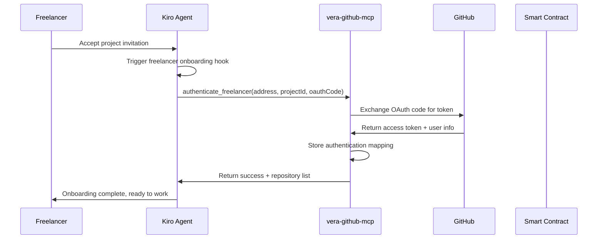
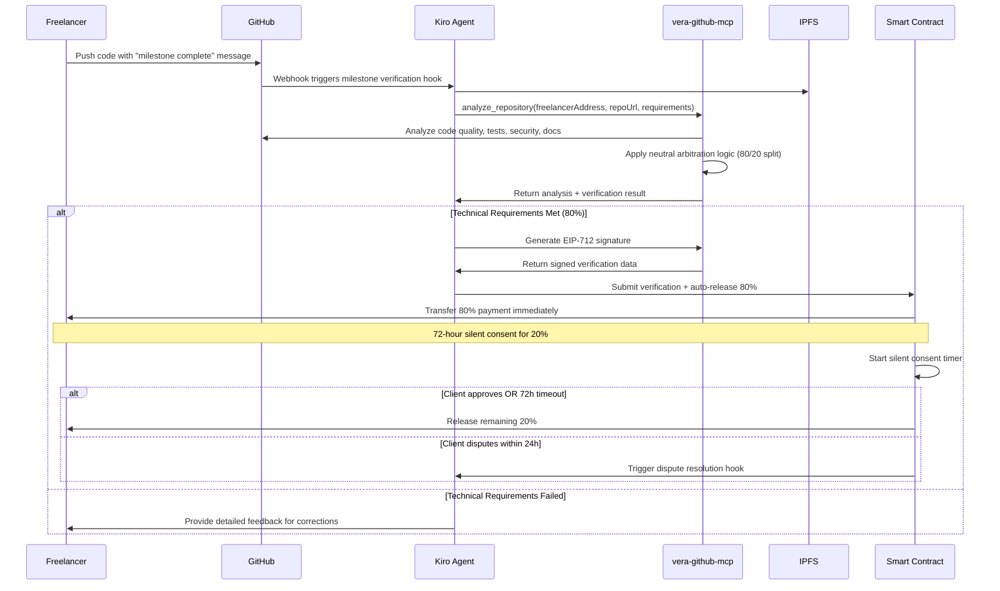
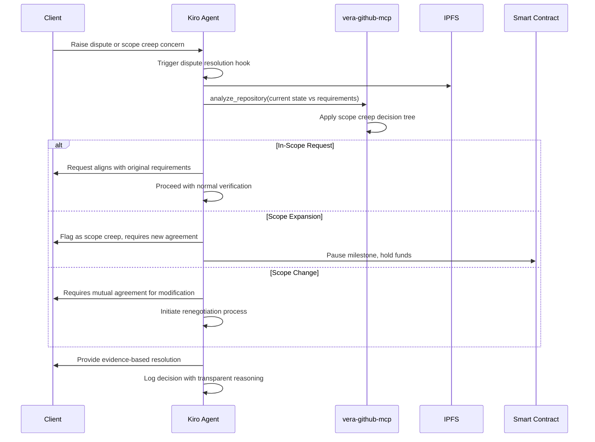

# Vera Protocol - Complete MCP Integration Guide

## 🎯 Overview

This guide explains how Vera Protocol's custom MCP (Model Context Protocol) servers integrate with Kiro to create a seamless AI-mediated escrow system. The integration enables automatic GitHub authentication, repository analysis, and milestone verification.

## 🏗️ Architecture Overview

```
┌─────────────────┐    ┌─────────────────┐    ┌─────────────────┐
│   Kiro Agent    │───▶│ vera-github-mcp │───▶│ GitHub API      │
│   (AI Brain)    │    │ (Custom Server) │    │ (Repository)    │
└─────────────────┘    └─────────────────┘    └─────────────────┘
         │                       │                       │
         │                       ▼                       │
         │              ┌─────────────────┐              │
         │              │ Repository      │              │
         │              │ Analysis        │              │
         │              └─────────────────┘              │
         │                       │                       │
         ▼                       ▼                       ▼
┌─────────────────┐    ┌─────────────────┐    ┌─────────────────┐
│ Smart Contract  │◀───│ EIP-712         │    │ IPFS Agreement  │
│ (Ethereum)      │    │ Signature       │    │ (Requirements)  │
└─────────────────┘    └─────────────────┘    └─────────────────┘
```

## 🔧 MCP Server Components

### 1. vera-github-mcp Server

**Purpose**: Custom MCP server for GitHub integration and milestone verification

**Key Features**:
- GitHub OAuth authentication for freelancers
- Comprehensive repository analysis
- Neutral arbitration logic implementation
- EIP-712 signature generation
- Milestone submission workflow

**Tools Provided**:
```typescript
- authenticate_freelancer    // GitHub OAuth + project linking
- analyze_repository        // Code quality, security, tests analysis
- submit_milestone         // Milestone submission with proof
- get_repository_metrics   // Detailed repository statistics
- verify_milestone_completion // Neutral arbitration assessment
```

### 2. Standard MCP Servers

**github-mcp-server**: Standard GitHub integration for basic repository operations
**fetch-mcp-server**: HTTP requests for IPFS content retrieval

## 🚀 Complete Integration Workflow

### Phase 1: Freelancer Onboarding



### Phase 2: Development & Submission



### Phase 3: Dispute Resolution



## 🔧 Setup Instructions

### 1. Install Custom MCP Server

```bash
# Navigate to MCP servers directory
cd backend-agents/mcp-servers

# Install dependencies
npm install

# Configure environment
cp .env.example .env
# Edit .env with your GitHub OAuth app credentials
```

### 2. Create GitHub OAuth App

1. Go to GitHub Settings → Developer settings → OAuth Apps
2. Create new OAuth App:
   - **Name**: Vera Protocol
   - **Homepage**: Your frontend URL
   - **Callback**: `http://localhost:3000/auth/github/callback`
3. Copy Client ID and Secret to `.env`

### 3. Configure Kiro MCP Settings

Edit `~/.kiro/settings/mcp.json`:

```json
{
  "mcpServers": {
    "vera-github": {
      "command": "node",
      "args": ["path/to/vera-protocol/backend-agents/mcp-servers/dist/vera-github-mcp.js"],
      "env": {
        "GITHUB_CLIENT_ID": "your_github_client_id",
        "GITHUB_CLIENT_SECRET": "your_github_client_secret",
        "ARBITER_PRIVATE_KEY": "your_ai_agent_private_key",
        "CONTRACT_ADDRESS": "your_deployed_contract_address"
      },
      "disabled": false,
      "autoApprove": ["authenticate_freelancer", "get_repository_metrics"]
    },
    "github": {
      "command": "uvx",
      "args": ["github-mcp-server@latest"],
      "env": {
        "GITHUB_TOKEN": "your_github_personal_access_token"
      },
      "disabled": false,
      "autoApprove": []
    },
    "fetch": {
      "command": "uvx",
      "args": ["fetch-mcp-server@latest"],
      "disabled": false,
      "autoApprove": ["fetch"]
    }
  }
}
```

### 4. Start MCP Server

```bash
# Development
npm run dev

# Production
npm run build
npm start
```

### 5. Test Integration

```bash
# In Kiro, test MCP connection
# Command palette: "MCP: Reconnect All Servers"
# Verify vera-github tools are available
```

## 🤖 Kiro Hook Integration

### Enhanced Milestone Verification Hook

**File**: `.kiro/hooks/vera-milestone-verification.kiro.hook`

**Trigger**: GitHub push with milestone keywords
**Action**: Comprehensive verification workflow

```json
{
  "trigger": {
    "type": "github_push",
    "repository": "*",
    "branch": "main"
  },
  "action": {
    "type": "agent_execution",
    "message": "🔍 VERA PROTOCOL: Milestone verification triggered...\n\n**VERIFICATION PROTOCOL:**\n1. Use vera-github-mcp to analyze repository\n2. Use #[fetch] to retrieve IPFS agreement\n3. Apply 80/20 arbitration logic\n4. Generate EIP-712 signature if approved\n5. Submit to smart contract"
  }
}
```

### Freelancer Onboarding Hook

**File**: `.kiro/hooks/vera-freelancer-onboarding.kiro.hook`

**Trigger**: Project invitation acceptance
**Action**: GitHub OAuth authentication

### Dispute Resolution Hook

**File**: `.kiro/hooks/vera-dispute-resolution.kiro.hook`

**Trigger**: Dispute or scope creep keywords
**Action**: Neutral arbitration with evidence-based resolution

## 🔒 Security & Authentication

### GitHub OAuth Flow

1. **Authorization Request**: Freelancer clicks "Connect GitHub"
2. **OAuth Redirect**: GitHub redirects with authorization code
3. **Token Exchange**: vera-github-mcp exchanges code for access token
4. **User Info**: Retrieve GitHub username and repository list
5. **Mapping Storage**: Link GitHub account to Ethereum address

### Security Features

- **Minimal Permissions**: Only request necessary repository access
- **Token Encryption**: Secure storage of OAuth tokens
- **Audit Trails**: Complete verification history logging
- **Rate Limiting**: Respect GitHub API rate limits

## 📊 Repository Analysis

### Code Quality Metrics

```typescript
interface CodeQuality {
  linesOfCode: number;
  files: number;
  languages: Record<string, number>;
  complexity: number;
}
```

### Security Assessment

```typescript
interface SecurityAnalysis {
  vulnerabilities: SecurityAdvisory[];
  dependencies: DependencyIssue[];
  secrets: SecretLeak[];
}
```

### Test Coverage

```typescript
interface TestAnalysis {
  hasTests: boolean;
  testFiles: string[];
  coverage: number;
}
```

### Documentation Check

```typescript
interface DocumentationAnalysis {
  hasReadme: boolean;
  hasApiDocs: boolean;
  hasDeploymentGuide: boolean;
}
```

## ⚖️ Neutral Arbitration Logic

### Technical Soundness Assessment (80%)

```typescript
const technicalScore = (
  codeQuality * 0.25 +      // ESLint, TypeScript, complexity
  functionality * 0.35 +    // Requirements met, tests pass
  security * 0.25 +         // No vulnerabilities, secure practices
  documentation * 0.15      // README, API docs, deployment guide
);

const technicalPassed = technicalScore >= 80;
```

### Scoring Criteria

- **Code Quality (25%)**:
  - ESLint/Prettier compliance
  - TypeScript type coverage
  - Code complexity metrics
  - Best practices adherence

- **Functionality (35%)**:
  - All acceptance criteria met
  - Unit tests passing
  - Integration tests passing
  - Performance benchmarks achieved

- **Security (25%)**:
  - No critical vulnerabilities
  - Dependency audit clean
  - No exposed secrets
  - Security best practices followed

- **Documentation (15%)**:
  - README with setup instructions
  - API documentation complete
  - Deployment guide provided
  - Code comments adequate

### Neutral Auditor Persona

The AI agent maintains strict neutrality by:

- **Emotionally Detached**: No bias toward either party
- **Evidence-Driven**: Decisions based solely on code analysis
- **Consistent Logic**: Same criteria regardless of project size
- **Transparent Reasoning**: Clear explanations with evidence
- **Time-Bounded**: 24-hour maximum decision window

## 🎯 Production Considerations

### Scalability

- **Horizontal Scaling**: Multiple MCP server instances
- **Load Balancing**: Distribute analysis workload
- **Caching**: Repository analysis result caching
- **Rate Limiting**: GitHub API quota management

### Monitoring

- **Health Checks**: Server availability monitoring
- **Performance Metrics**: Analysis time tracking
- **Error Logging**: Comprehensive error tracking
- **Security Monitoring**: Authentication audit logs

### Reliability

- **Failover**: Backup MCP server instances
- **Retry Logic**: Automatic retry for transient failures
- **Circuit Breakers**: Prevent cascade failures
- **Graceful Degradation**: Fallback to manual verification

## 🏆 HackXios 2k25 Integration

### Kiro Track Demonstration

1. **Advanced MCP Usage**: Custom server with OAuth integration
2. **Intelligent Workflows**: Neutral arbitration with evidence-based decisions
3. **Automation**: GitHub push triggers automatic verification
4. **Voice Integration**: Natural language project creation

### Ethereum Track Demonstration

1. **Smart Contract Integration**: EIP-712 signatures trigger payments
2. **Decentralized Architecture**: No centralized database dependencies
3. **Security**: Production-grade contract with audit-ready features
4. **Innovation**: AI-mediated escrow with immutable fairness guarantees

## 🚀 Getting Started

1. **Deploy Smart Contract**: Follow deployment guide
2. **Configure MCP Servers**: Set up GitHub OAuth and custom server
3. **Test Integration**: Create project with voice, authenticate freelancer
4. **Verify Workflow**: Push code, watch automatic verification
5. **Demo Ready**: Complete voice-to-payment flow working

---

**Vera Protocol - Eliminating freelance fraud with AI-mediated neutral arbitration** 🚀

*Built for HackXios 2k25 - Winning both Kiro and Ethereum tracks through technical innovation and production excellence.*